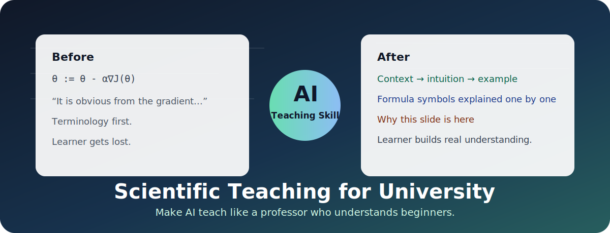
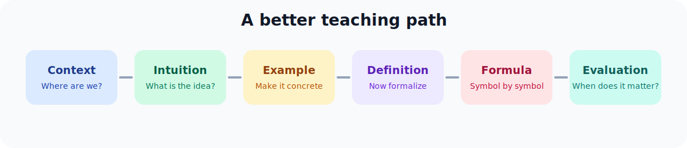
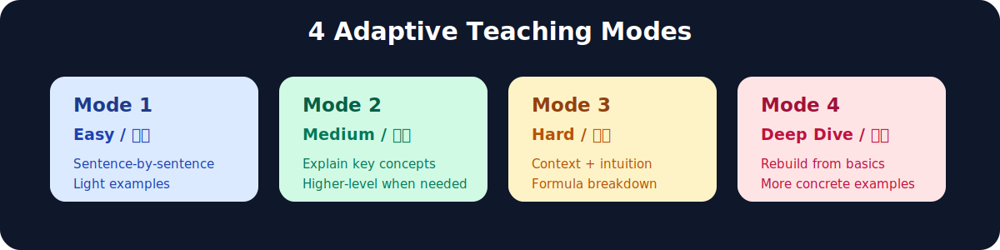
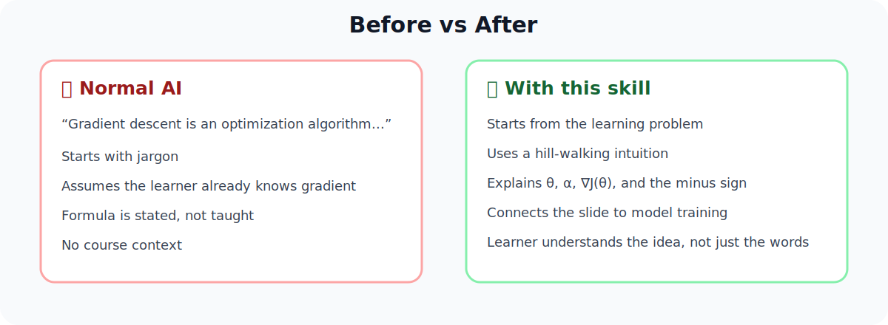

# 🎓 scientific-teaching-for-university

<p align="center">
  
</p>

<p align="center">
  <strong>Turn AI from “answer generator” into a professor who actually teaches.</strong><br>
  <strong>让 AI 不只是回答你，而是真正把知识点教会你。</strong>
</p>

<p align="center">
  <a href="#-english-guide">English Guide</a> ·
  <a href="#-中文指南">中文指南</a> ·
  <a href="#-quick-start">Quick Start</a> ·
  <a href="#-version-selection--版本选择">Versions</a> ·
  <a href="#-license">License</a>
</p>

---

# 🇬🇧 English Guide

## ✨ What Makes This Different?

Most AI explanations fail for a very specific reason: the model often explains from the perspective of someone who already understands the topic. It gives the correct conclusion, but it does not rebuild the mental path that a beginner needs in order to get there.

This skill changes that teaching posture. It asks the AI to start from the learner's cognitive starting point, then build upward: context first, intuition next, examples before abstraction, formal definitions only after the learner has something to hold onto.

<p align="center">
  
</p>

| Normal AI answer | This skill |
|---|---|
| Dumps terminology | Starts with context and intuition |
| Gives the final formula | Explains what the formula is trying to do |
| Assumes prerequisites | Fills in missing background |
| Answers one question | Teaches the slide as part of a course |
| Sounds professional | Makes the learner understand |

## 🧠 Introduction

`scientific-teaching-for-university` is an educational-psychology-based AI teaching skill for university students. It is designed for lecture notes, slides, formulas, abstract concepts, and hard technical courses where normal AI explanations often become too compressed.

The skill is built around one idea: good teaching is not the same as correct answering. A correct answer may still be useless if the learner cannot see where the idea comes from, why it matters, how it connects to the current lecture, or how each symbol in a formula works.

This skill makes the AI behave more like a patient professor:

- It first explains where the current slide sits in the course.
- It gives the learner a plain-language intuition before formal language.
- It uses examples to make abstract concepts concrete.
- It explains formulas symbol by symbol instead of treating them as magic.
- It gives an evaluation of each concept: why it matters, when it is useful, what its limits are, and what similar ideas it is often confused with.
- It explains why the instructor placed this content, example, table, or formula at this exact point in the lecture.
- It moves one slide at a time, then stops, so the learner can digest and ask follow-up questions.

The target is not shorter answers. The target is better learning.

## 🧩 Four Teaching Modes

<p align="center">
  
</p>

### 🟦 Mode 1: Easy

Use this for descriptive, memory-heavy, or conceptually simple courses. The AI focuses on sentence-by-sentence explanation, light paraphrasing, and basic examples. It should still explain the slide's role in the lecture, but it should not over-expand simple material.

Best for: introductory business slides, humanities notes, definitions, lightweight conceptual material.

### 🟩 Mode 2: Medium

Use this when the course is mostly understandable but some concepts need extra scaffolding. The AI still explains the slide sentence by sentence, but it pauses for harder concepts and gives a higher-level explanation, examples, and concept evaluation when needed.

Best for: economics, statistics introductions, applied CS, social science methods, or any course where most slides are readable but some ideas are easy to misunderstand.

### 🟨 Mode 3: Hard

Use this for technical, mathematical, abstract, or concept-dense courses. The AI shifts from “explaining sentences” to real teaching. It should unpack the learning goal of the slide, identify difficult concepts, build intuition, introduce formal definitions, dissect formulas, and explain how the slide connects to the course structure.

Best for: machine learning, algorithms, linear algebra, probability, optimization, operating systems, theory-heavy CS, engineering, and math-heavy lectures.

### 🟥 Mode 4: Deep Dive

Use this when Mode 3 is still too hard. Instead of repeating the same explanation, the AI must go one level more basic. It should identify the missing prerequisite, rebuild the idea from a simpler starting point, use a new analogy or smaller example, and then climb back toward the original concept step by step.

Best for: “I still don't get it,” “start from scratch,” “make it more basic,” or “my foundation is not enough.”

## 🚀 Quick Start

<p align="center">
  <a href="#-english-guide">English Guide</a> ·
  <a href="#-中文指南">中文指南</a> ·
  <a href="#-version-selection--版本选择">Versions</a>
</p>

Download the repository:

```bash
git clone https://github.com/Punktheory/scientific-teaching-for-university.git
cd scientific-teaching-for-university
```

Install the default skill for Codex:

```bash
cp -R ./scientific-teaching-for-university ~/.codex/skills/scientific-teaching-for-university
```

Windows PowerShell:

```powershell
Copy-Item -Recurse .\scientific-teaching-for-university "$env:USERPROFILE\.codex\skills\scientific-teaching-for-university"
```

For Claude Code or any AI tool with custom instructions, point it to the downloaded `scientific-teaching-for-university/SKILL.md`.

For Codex or any tool that loads folders directly, install the skill folder first, then invoke the mode you want.

Then start with:

```text
Use scientific-teaching-for-university in hard mode.
First read the whole lecture note and summarize the course structure.
Then I will paste slides one by one. Teach each slide from a beginner's perspective.
```

## 🔥 Before / After Example

<p align="center">
  
</p>

### Slide content

```text
Gradient descent updates parameters in the opposite direction of the gradient:

θ := θ - α∇J(θ)
```

<table>
  <tr>
    <td width="50%" valign="top">
      <h3>❌ Without this skill</h3>
      <p>Gradient descent is an optimization algorithm that updates parameters by subtracting the learning rate times the gradient of the cost function.</p>
      <p>The gradient points in the direction of steepest ascent, so subtracting it minimizes the function.</p>
      <p><strong>Problem:</strong> correct, but compressed. It assumes the learner already knows what gradient, cost function, parameter update, and steepest ascent mean.</p>
    </td>
    <td width="50%" valign="top">
      <h3>✅ With this skill</h3>
      <p><strong>1. Start from the learning problem:</strong></p>
      <blockquote>The model is not good enough yet. How do we adjust its parameters step by step so the loss becomes smaller?</blockquote>
      <p><strong>2. Give intuition:</strong></p>
      <p>Imagine the loss as the height of a mountain. The gradient is the steepest uphill direction. To reduce loss, we move the opposite way.</p>
      <p><strong>3. Decode the formula:</strong></p>
      <p><code>θ := θ - α∇J(θ)</code></p>
      <p><code>θ</code> is the parameter, <code>α</code> is step size, <code>∇J(θ)</code> is the uphill direction, and the minus sign means “walk downhill.”</p>
      <p><strong>4. Explain why this slide is here:</strong></p>
      <p>After defining loss, the course naturally asks how to make that loss smaller. Gradient descent is the bridge from objective to training.</p>
    </td>
  </tr>
</table>

# 🇨🇳 中文指南

## ✨ 这个 Skill 有什么不一样？

普通 AI 解释经常不好用，不是因为它不会这个知识点，而是因为它默认站在“已经懂了的人”的角度讲。它可能给出正确答案，但没有重建一个初学者理解这个答案所需要的认知路径。

这个 skill 改变的是 AI 的教学姿态：先站在学习者的起点，再一步步往上搭。先给上下文，再给直觉；先用例子落地，再引入抽象定义；公式不是直接甩出来，而是逐个符号拆开。

<p align="center">
  
</p>

| 普通 AI 回答 | 这个 skill |
|---|---|
| 一上来堆术语 | 先给上下文和直觉 |
| 直接甩公式 | 先解释公式到底想干什么 |
| 默认你懂前置知识 | 主动补前置背景 |
| 只回答一个问题 | 把这一页 slide 放回课程结构里教 |
| 听起来很专业 | 让学习者真的听懂 |

## 🧠 中文介绍

读大学最崩溃的瞬间之一：打开讲义，满屏公式和术语，问 AI 之后它又甩你一脸“专业黑话”，越问越懵。

这个项目就是为了解决这个问题。

它把一套基于教育心理学和真实学习经验的教学方法做成 AI skill，让 AI 按一个真正会教学的教授那样讲。这里的重点不是让 AI “回答得更长”，而是让 AI 的解释符合学习者真正理解知识的路径。

它会要求 AI：

- 先解释这页 slide 在整门课里的位置；
- 先用人话建立直觉，再引入专业术语；
- 用例子把抽象概念落到具体场景；
- 遇到公式时先讲“这个公式想干什么”，再逐个符号拆；
- 给每个概念补“概念评价”：它为什么重要、什么时候用、有什么局限、容易和什么混淆；
- 解释“老师为什么把这个内容 / 例子 / 表格 / 公式放在这里”；
- 一页一页讲，讲完一页停下来，让学习者能消化和追问。

核心目的只有一个：通过这个 skill，让 AI **真正教会你**。

## 🧩 四档教学模式

<p align="center">
  
</p>

### 🟦 Mode 1：简单内容

适合偏记忆、偏描述、概念本身不难的课程。AI 会以逐句讲解为主，帮助你准确理解 slide 每句话是什么意思，同时轻量补充上下文、例子和概念评价。这个模式不会过度深挖，避免把简单内容讲复杂。

适合：入门商科、人文社科描述性内容、定义型 slide、轻量概念课。

### 🟩 Mode 2：重点内容

适合大部分内容能看懂，但开始出现一些需要解释的重点概念。AI 仍然会逐句讲解，但遇到容易误解、容易卡住的地方，会额外做高层次解释、举例、补充概念评价。

适合：经济学、统计入门、应用计算机、社会科学方法课，或任何“多数能读，但有些地方容易不懂”的课。

### 🟨 Mode 3：困难内容

适合数学、计算机、工程、理论课、抽象概念密集的课程。AI 会从“翻译句子”切换到“真正教学”：先讲这页想解决什么问题，再识别难概念，给直觉，给例子，补正式定义，拆公式，最后解释这页和课程前后内容的关系。

适合：机器学习、算法、线性代数、概率论、优化、操作系统、理论计算机、工程数学等硬核课程。

### 🟥 Mode 4：追加深挖

适合 Mode 3 讲完以后你还是不懂的情况。AI 不应该把原来的解释重复一遍，而是要承认原解释对你当前基础来说仍然太快，然后往更基础处退一步，找出缺失的前置知识，用更小的例子或新的类比重新搭台阶。

适合：“还是没懂”“从头讲”“再基础一点”“我基础没到”。

## 🚀 快速使用

<p align="center">
  <a href="#-english-guide">English Guide</a> ·
  <a href="#-中文指南">中文指南</a> ·
  <a href="#-version-selection--版本选择">Versions</a>
</p>

下载仓库：

```bash
git clone https://github.com/Punktheory/scientific-teaching-for-university.git
cd scientific-teaching-for-university
```

在 Codex 中安装默认版本：

```bash
cp -R ./scientific-teaching-for-university ~/.codex/skills/scientific-teaching-for-university
```

Windows PowerShell：

```powershell
Copy-Item -Recurse .\scientific-teaching-for-university "$env:USERPROFILE\.codex\skills\scientific-teaching-for-university"
```

Claude Code 或其他支持 custom instructions 的 AI 工具：让 AI 使用下载后的 `scientific-teaching-for-university/SKILL.md` 作为指令文件。

如果你的工具支持直接加载文件夹，就先安装 skill 文件夹，再按需要选择 mode 调用。

然后这样开始：

```text
启用 scientific-teaching-for-university，困难模式。
请先通读整份讲义，告诉我这门课的大框架。
然后我会一页一页贴 slide，请你按初学者视角真正教会我。
```

## 🔥 使用前后对比示例

<p align="center">
  
</p>

### Slide 内容

```text
Gradient descent updates parameters in the opposite direction of the gradient:

θ := θ - α∇J(θ)
```

<table>
  <tr>
    <td width="50%" valign="top">
      <h3>❌ 不使用这个 skill</h3>
      <p>Gradient descent is an optimization algorithm that updates parameters by subtracting the learning rate times the gradient of the cost function.</p>
      <p>The gradient points in the direction of steepest ascent, so subtracting it minimizes the function.</p>
      <p><strong>问题：</strong>这段话是对的，但太压缩了。它默认你已经知道 gradient、cost function、parameter update、steepest ascent 是什么。</p>
    </td>
    <td width="50%" valign="top">
      <h3>✅ 使用这个 skill</h3>
      <p><strong>1. 先从学习问题出发：</strong></p>
      <blockquote>模型现在表现不好，我们怎么一点点调整参数，让 loss 变小？</blockquote>
      <p><strong>2. 给直觉：</strong></p>
      <p>把 loss 想象成一座山的高度。gradient 是最陡的上坡方向。我们想让 loss 下降，所以要往它的反方向走。</p>
      <p><strong>3. 拆公式：</strong></p>
      <p><code>θ := θ - α∇J(θ)</code></p>
      <p><code>θ</code> 是参数，<code>α</code> 是每一步走多大，<code>∇J(θ)</code> 是上坡方向，减号表示“往下坡走”。</p>
      <p><strong>4. 解释为什么这页放这里：</strong></p>
      <p>课程前面定义了 loss，下一步自然要问怎么让 loss 变小。Gradient descent 就是从“定义目标”走向“训练模型”的桥。</p>
    </td>
  </tr>
</table>

## Why It Matters

Good teaching is not dumping knowledge.

Good teaching means building stairs:

```text
context → intuition → example → definition → formula → evaluation → practice
```

This skill packages that teaching method into reusable AI instructions, so more students can use AI for serious learning instead of shallow Q&A.

---

## 🌍 Version Selection / 版本选择

| Version | Folder | Best for |
|---|---|---|
| 🌏 Default bilingual / 默认中英混合版 | `scientific-teaching-for-university` | Chinese explanations with English technical terms. Best for Chinese-native students studying English lecture notes. |
| 🇨🇳 Chinese version / 全中文版 | `scientific-teaching-for-university-chinversion` | Full Chinese teaching. Best when you want the explanation to be as Chinese-friendly as possible. |
| 🇬🇧 English version / 全英文版 | `scientific-teaching-for-university-englishversion` | Full English teaching. Best for public / international users. |

---

## License

This repository is released under the MIT License.

See [LICENSE](./LICENSE) for details.

---

## 🧩 Repository Structure

```text
.
├── assets/readme/
│   ├── hero.svg
│   ├── workflow.svg
│   ├── modes.svg
│   └── comparison.svg
├── LICENSE
├── scientific-teaching-for-university/
│   ├── SKILL.md
│   ├── agents/openai.yaml
│   └── references/pedagogy.md
├── scientific-teaching-for-university-chinversion/
│   ├── SKILL.md
│   ├── agents/openai.yaml
│   └── references/pedagogy.md
└── scientific-teaching-for-university-englishversion/
    ├── SKILL.md
    ├── agents/openai.yaml
    └── references/pedagogy.md
```
